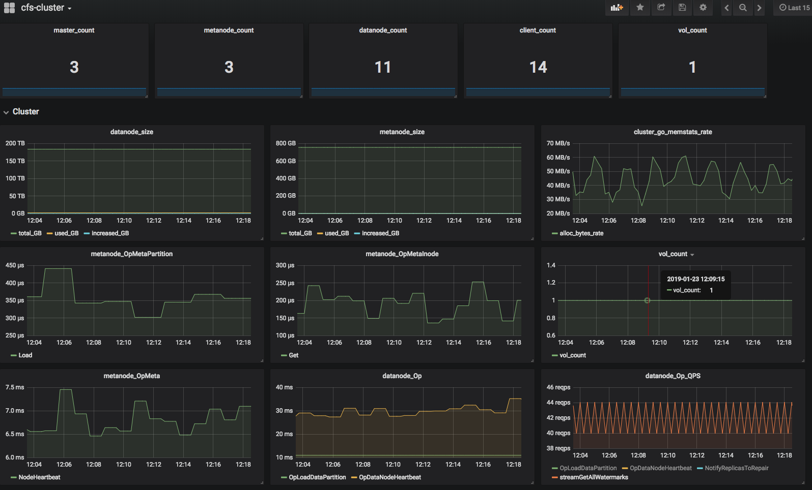

性能监控
-----------------------

CFS 集成了prometheus作为性能监控指标采集模块。在各模块配置文件中增加如下配置参数来启用该模块：

.. code-block:: json

   {
       "exporterPort": 9510,
       "consulAddr": "http://consul.prometheus-cfs.local"
   }

* exporterPort: prometheus指标暴露端口号。设置后，可通过URL(http://$hostip:$exproterProt/metrics) 暴露prometheus监控指标。若不设置，prometheus指标监控模块将不会工作。
* consulAddr: consul注册服务器地址。设置后，可配合prometheus的自动发现机制实现cfs节点exporter的自动发现服务。若不设置，将不会启用consul自动注册服务。

可使用grafana作为prometheus 监控指标的展示前端，如下图所示：

可以通过prometheus alertmanager组件进行配置，来实现cfs系统的监控指标报警通知服务，详细可参考 `alertmanager文档 <https://prometheus.io/docs/alerting/alertmanager>`_。

相关链接：

1. `prometheus 安装配置 <https://prometheus.io/docs/prometheus/latest/getting_started>`_
2. `consul 安装配置 <https://www.consul.io/docs/install/index.html>`_
3. `grafana 安装配置 <http://docs.grafana.org/guides/getting_started>`_

Grafana 监控面板配置模板如下：

.. literalinclude:: cfs-grafana-dashboard.json
   :language: json

